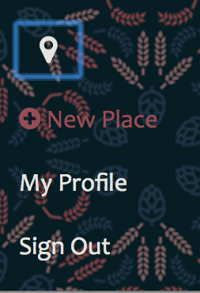
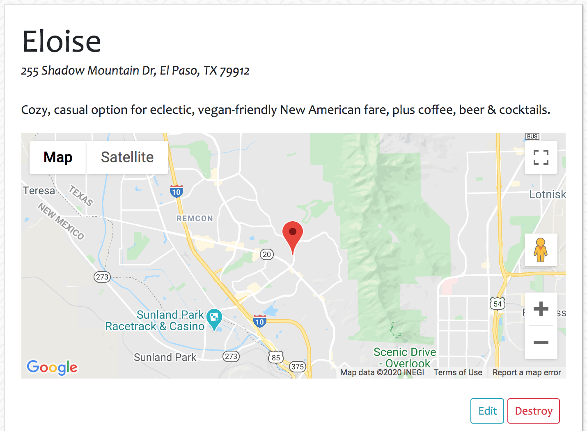

# About Nomster

A Yelp clone that integrates with the Google Maps API and includes features like user comments, star ratings, image uploading, and user authentication.

## How to Use

In order to fully interact with the application, sign in or sign up with an email account. Once signed in, you are able to see any restaurants and add new ones.

### Add a New Place 

To add a new place, click on the location icon on the top left corner of the homepage, and then on *New Place* from the drop down menu.

Fill out all the information, and be especially careful with adding the address in a correct format.

Once submitted, you will be redirected to the new place, where you will be able to see a Google map with its location, as well as edit and add comments.

## Credits

* **The Coding Bootcamp** - *University of Texas - Austin* - [Course Link](https://techbootcamps.utexas.edu/coding/online/landing/?tc_ver=1&s=Google-Brand&pkw=ut%20austin%20coding%20bootcamp&pcrid=397231697230&pmt=e&utm_source=google&utm_medium=cpc&utm_campaign=GGL%7CUT-Austin%7CSEM%7CCODING%7C-%7CONL%7CTIER-1%7CALL%7CBRD%7CEXACT%7CCore%7CBootcamp&utm_term=ut%20austin%20coding%20bootcamp&utm_content=397231697230&s=google&k=ut%20austin%20coding%20bootcamp&gclid=EAIaIQobChMI16eEysjL5wIVh5OzCh03vAWNEAAYASAAEgKc8PD_BwE&gclsrc=aw.ds)

* *Rosy Arreola* - [Homepage](https://rosyarreola.netlify.com/)